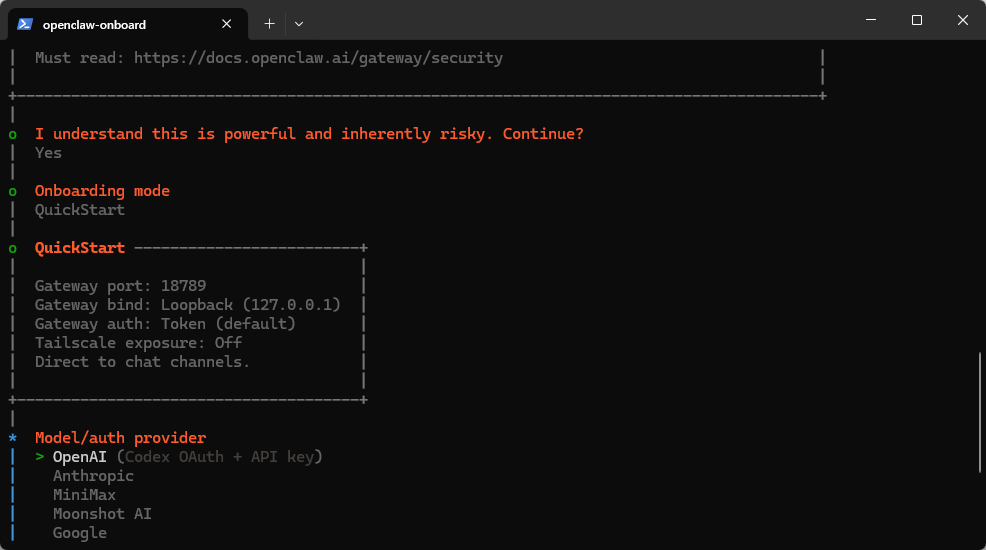
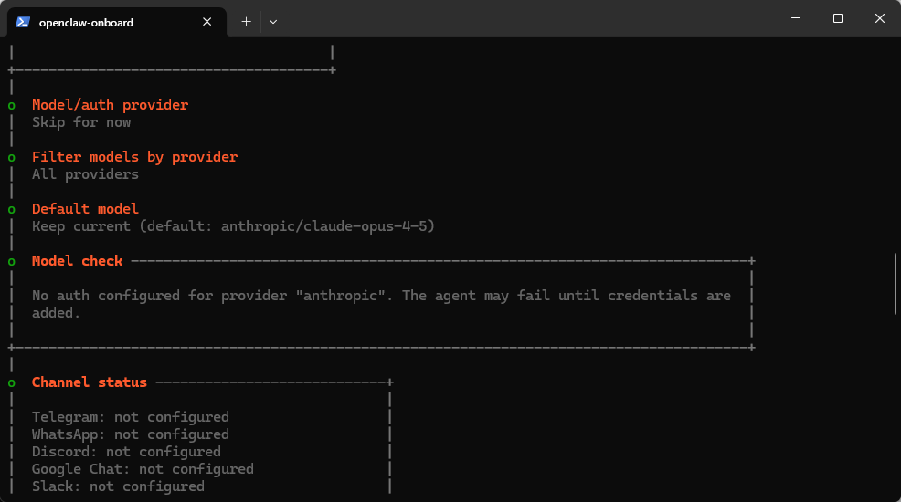
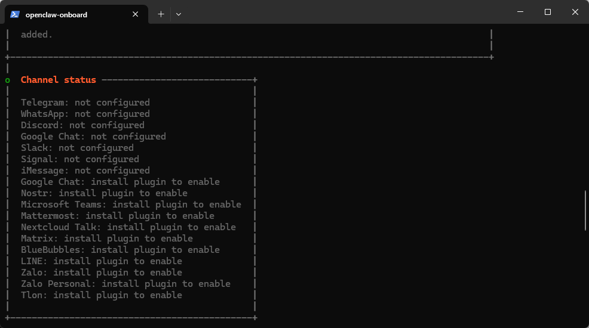
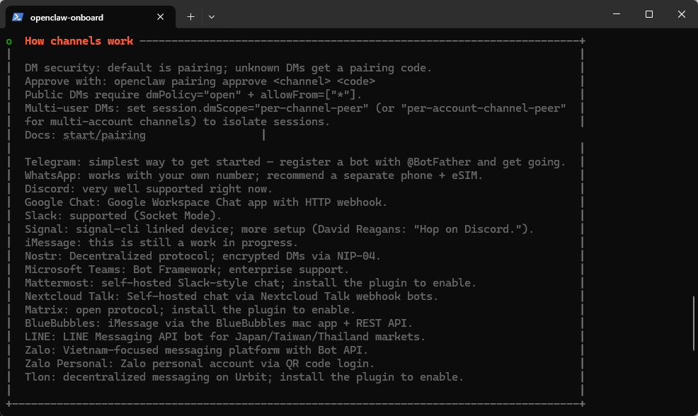
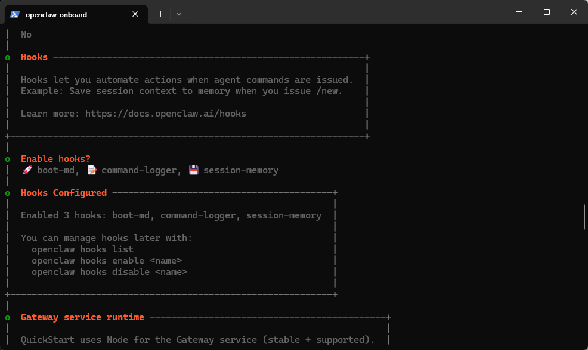
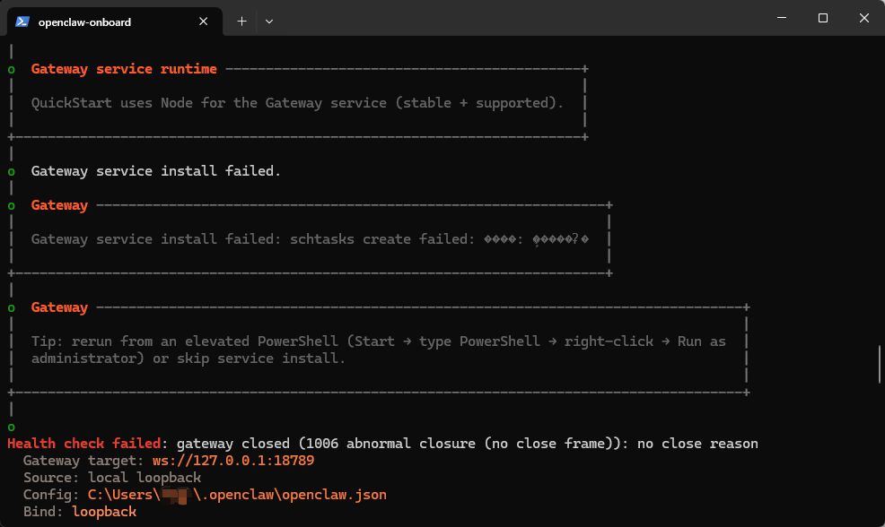
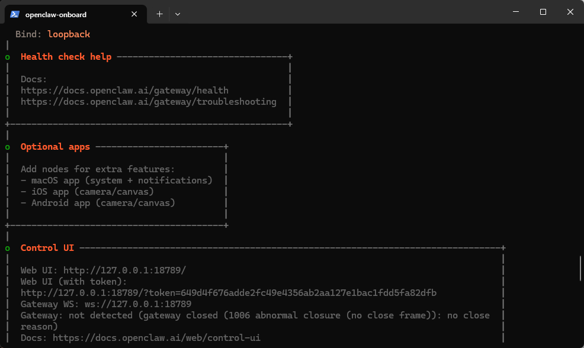
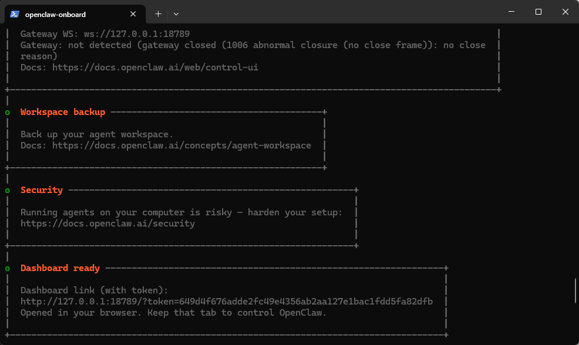
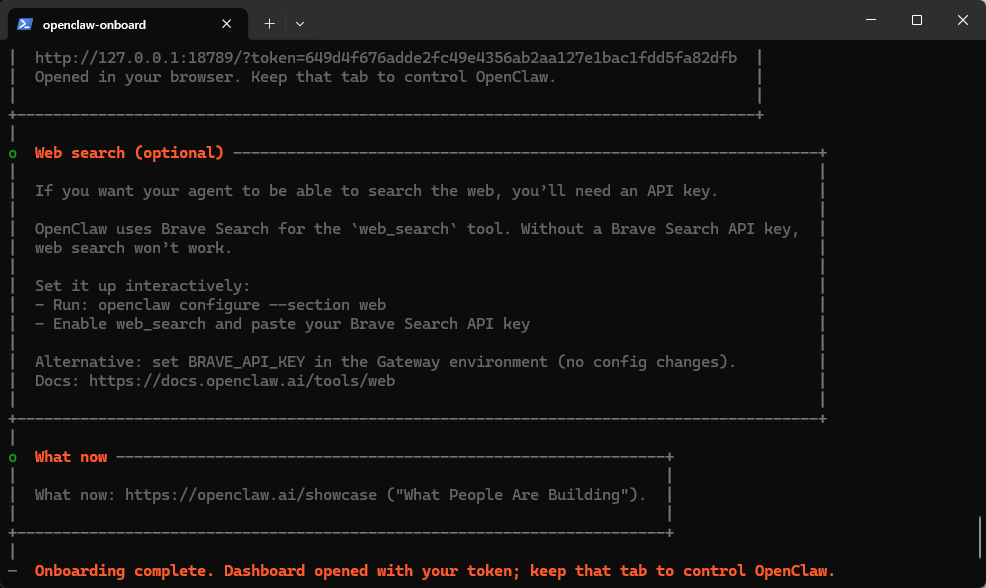
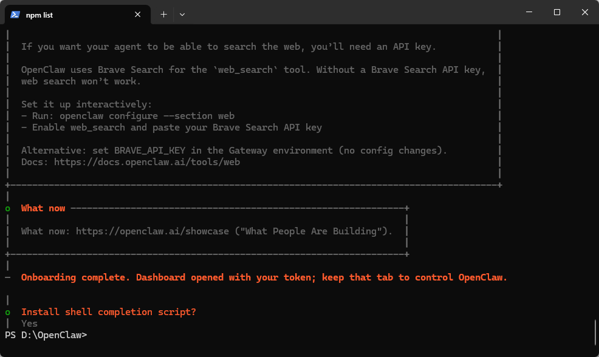

# Installing-OpenClaw-in-Windows
This article provides instructions on how to install OpenClaw in the Windows environment, configure it properly, and run it in the WebUI.

1. 安装OpenClaw

### 第一步：执行安装openclaw命令

如果你使用的是PowerShell，则执行如下命令

```powershell
iwr -useb https://openclaw.ai/install.ps1 | iex
```
如果你使用的是CMD，则执行如下命令
```powershell
curl -fsSL https://openclaw.ai/install.cmd -o install.cmd && install.cmd && del install.cmd
```
下面我使用的是PowerShell进行演示。
### 第二步：选择QuickStart

先选择Yes（就是知晓风险的意思），然后再选择QuickStart（快速开始）。


### 第三步：先跳过provider




### 第四步：Configure skills now？No

-mosaic.png)
### 第五步：Enable hooks？

三个都选上。【操作：上下箭头切换，按空格选中】


### 第六步：成功了，自动打开网页

到这一步，openclaw会自动打开网页：[http://127.0.0.1:18789](http://127.0.0.1:18789/)


这里可以看到openclaw的安装目录以及配置文件：

openclaw安装主目录： C:\Users\你的用户名\.openclaw

openclaw配置文件： C:\Users\你的用户名\.openclaw\openclaw.json





### 第七步：Install shell completion script？Yes

选择Yes，表示同意安装 shell 自动补全脚本。



apikey存储路径：C:\Users\你的用户名\.openclaw\agents\main\agent\auth-profiles.json

这个apikey是指大语言模型的ApiKey，国内的有：智普AI（zai），月之暗面AI（Kimi）。这个apikey需要自己去获取。


1. 配置OpenClaw

2. 最简单的配置

这种配置是使用zai默认配置，最简单。openclaw.json配置Gateway端口，bind模式，以及token等信息，关键的apikey存放在auth-profiles.json文件中，apikey不存储在主配置文件里，提升安全性。


主配置文件(Gateway端口、bind 模式、token等)：

C:\Users\你的用户名\.openclaw\openclaw.json

```powershell
{
  "agents": {
    "defaults": {
      "workspace": "C:\\Users\\你的用户名\\.openclaw\\workspace",
      "models": {
        "zai/glm-4.7": {
          "alias": "GLM"
        }
      },
      "model": {
        "primary": "zai/glm-4.7"
      }
    }
  },
  "gateway": {
    "mode": "local",
    "auth": {
      "mode": "token",
      "token": "7acc5b3029ded44d4cda632e42e05173388c1c3a2a29909f"
    },
    "port": 18789,
    "bind": "loopback",
    "tailscale": {
      "mode": "off",
      "resetOnExit": false
    }
  },
  "auth": {
    "profiles": {
      "zai:default": {
        "provider": "zai",
        "mode": "api_key"
      }
    }
  },
  "hooks": {
    "internal": {
      "enabled": true,
      "entries": {
        "boot-md": {
          "enabled": true
        },
        "command-logger": {
          "enabled": true
        },
        "session-memory": {
          "enabled": true
        }
      }
    }
  },
  "wizard": {
    "lastRunAt": "2026-02-02T09:26:38.390Z",
    "lastRunVersion": "2026.1.30",
    "lastRunCommand": "onboard",
    "lastRunMode": "local"
  },
  "meta": {
    "lastTouchedVersion": "2026.1.30",
    "lastTouchedAt": "2026-02-02T09:26:38.407Z"
  }
}
```
AI模型APIkey/OAuth凭据：C:\Users\你的用户名\.openclaw\agents\main\agent\auth-profiles.json
```powershell
{
  "version": 1,
  "profiles": {
    "zai:default": {
      "type": "api_key",
      "provider": "zai",
      "key": "YOUR-ZHIPU-ZAI-API-KEY"
    }
  },
  "lastGood": {
    "zai": "zai:default"
  },
  "usageStats": {
    "zai:default": {
      "lastUsed": 1770106278445,
      "errorCount": 0
    }
  }
}
```
需要将YOUR-ZHIPU-ZAI-API-KEY替换为你真实的zai apikey。
然后启动OpenClaw gateway，启动方式有两种：

* 命令行直接重启，openclaw gateway restart

* 手动重启，先 Ctrl+C 停止，然后：openclaw gateway --port 18789 --verbose

启动完gateway，就可以通过[http://127.0.0.1:18789/](http://127.0.0.1:18789/)这个链接访问Web UI了，赶紧试试吧。


1. 配置多个大模型

这种配置适合有多个大语言模型的apikey，可以随时切换，还可以做主备自动切换。例如有，智普GLM-4.7和月之暗面Kimi K2.5两个模型的apikey，那么你就可以按照这个配置来进行。


主配置文件(Gateway端口、bind 模式、token等)：

C:\Users\你的用户名\.openclaw\openclaw.json

```powershell
{
  "agents": {
    "defaults": {
      "workspace": "C:\\Users\\你的用户名\\.openclaw\\workspace",
      "models": {
        "moonshot-kimi/kimi-k2.5": {},
        "zai-cn/glm-4.7": {}
      },
      "model": {
        "primary": "moonshot-kimi/kimi-k2.5",
        "fallbacks": ["zai-cn/glm-4.7"]
      }
    }
  },
  "models": {
    "mode": "merge",
    "providers": {
      "moonshot-kimi": {
        "baseUrl": "https://api.kimi.com/coding",
        "api": "anthropic-messages",
        "models": [
          {
            "id": "kimi-k2.5",
            "name": "Kimi K2.5"
          }
        ]
      },
      "zai-cn": {
        "baseUrl": "https://open.bigmodel.cn/api/anthropic",
        "api": "anthropic-messages",
        "models": [
          {
            "id": "glm-4.7",
            "name": "GLM-4.7 (China)"
          }
        ]
      }
    }
  },
  "gateway": {
    "mode": "local",
    "auth": {
      "mode": "token",
      "token": "7acc5b3029ded44d4cda632e42e05173388c1c3a2a29909f"
    },
    "port": 18789,
    "bind": "loopback",
    "tailscale": {
      "mode": "off",
      "resetOnExit": false
    }
  },
  "hooks": {
    "internal": {
      "enabled": true,
      "entries": {
        "boot-md": {
          "enabled": true
        },
        "command-logger": {
          "enabled": true
        },
        "session-memory": {
          "enabled": true
        }
      }
    }
  },
  "wizard": {
    "lastRunAt": "2026-02-02T09:26:38.390Z",
    "lastRunVersion": "2026.1.30",
    "lastRunCommand": "onboard",
    "lastRunMode": "local"
  },
  "meta": {
    "lastTouchedVersion": "2026.1.30",
    "lastTouchedAt": "2026-02-02T09:26:38.407Z"
  }
}
```
AI模型apikey/OAuth凭据：C:\Users\你的用户名\.openclaw\agents\main\agent\auth-profiles.json
```powershell
{
  "version": 1,
  "profiles": {
    "moonshot-kimi:default": {
      "type": "api_key",
      "provider": "moonshot-kimi",
      "key": "YOUR-MOONSHOT-KIMI-API-KEY"
    },
    "zai-cn:default": {
      "type": "api_key",
      "provider": "zai-cn",
      "key": "YOUR-ZHIPU-ZAI-API-KEY"
    }
  },
  "lastGood": {
    "moonshot-kimi": "moonshot-kimi:default",
    "zai-cn": "zai-cn:default"
  },
  "usageStats": {
    "moonshot-kimi:default": {
      "lastUsed": 1770194226531,
      "errorCount": 0
    },
    "zai-cn:default": {
      "lastUsed": 1770120292754,
      "errorCount": 0
    }
  }
}
```
需要将【YOUR-MOONSHOT-KIMI-API-KEY】和【YOUR-ZHIPU-ZAI-API-KEY】替换为你真实的apikey。
然后启动OpenClaw gateway，启动方式有两种：

* 命令行直接重启，openclaw gateway restart

* 手动重启，先 Ctrl+C 停止，然后：openclaw gateway --port 18789 --verbose

启动完gateway，就可以通过[http://127.0.0.1:18789/](http://127.0.0.1:18789/)这个链接访问Web UI了，赶紧试试吧。

